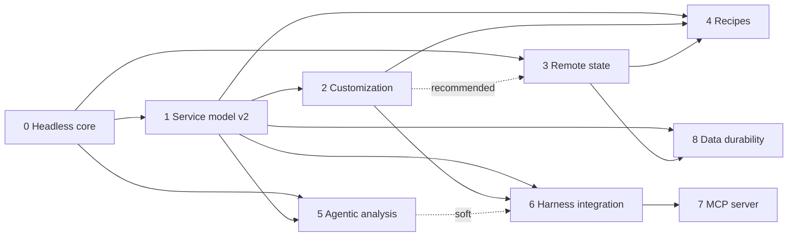

# Opsmith migration plan

Status: draft v1, 2026-09-04.
Scope: the changes needed to (1) deploy prebuilt open-source apps through recipes, (2) integrate with coding harnesses, and (3) replace the repo map with agentic analysis, plus the foundation work all three depend on.

The specs live in [`../specs/`](../specs/), one per phase:

| Phase | Spec | Depends on | Size | Ships as |
|------:|------|------------|------|----------|
| 0 | [Headless core](../specs/2026-09-04-phase-0-headless-core/) | – | L | 0.5.0 |
| 1 | [Service model v2 and deterministic rendering](../specs/2026-09-04-phase-1-service-model-v2.md) | 0 | XL | 0.6.0 |
| 2 | [Customization layer](../specs/2026-09-04-phase-2-customization.md) | 0, 1 | M | 0.6.0, with phase 1 |
| 3 | [Remote state and config sync](../specs/2026-09-04-phase-3-remote-state.md) | 0; 2 recommended first | M | 0.7.0 |
| 4 | [Recipes](../specs/2026-09-04-phase-4-recipes.md) | 1, 2, 3 | L | 0.8.0 |
| 5 | [Agentic repo analysis](../specs/2026-09-04-phase-5-agentic-analysis.md) | 0, 1 | M | 0.9.0 |
| 6 | [Coding-harness integration](../specs/2026-09-04-phase-6-harness-integration.md) | 0, 1, 2; 5 soft | M | 1.0.0 |
| 7 | [MCP server](../specs/2026-09-04-phase-7-mcp-server.md) | 6 | S | 1.0.x |
| 8 | [Data durability](../specs/2026-09-04-phase-8-data-durability.md) | 1, 3 | M | 1.1.0 |

Phase 0 is specified as seven parts inside [its spec folder](../specs/2026-09-04-phase-0-headless-core/), each a merge unit that lands on its own; the folder's README is the index.

Sizes are relative effort, not dates. Phases 3 and 5 can run in parallel with their neighbours once their dependencies have landed. Phases 1 and 2 ship in one release: the first deterministic release overwrites hand-edited compose files, and phase 2 provides the override file where those edits belong.



## Why a migration rather than three features

Every one of the planned capabilities is blocked by the same properties of the code today:

1. **The model is used where code belongs.** `MonolithicDeploymentStrategy._generate_docker_compose` asks it to merge compose snippets and invent env values on every attempt, `_deploy_validate_docker_compose` asks it to judge success from container logs on every release, and `_select_virtual_machine_type` asks it to size a VM with no declared resource needs. Those steps are rendering and arithmetic, not judgment: they are slow, non-deterministic, untestable, and tied to one strategy. The model stays where judgment is needed, on analysis, generation, estimation and diagnosis.
2. **Every flow is interactive.** `inquirer` prompts live in `main.py`, `service_detector.py`, `deployment_strategies/monolithic.py` and inside `cloud_providers/aws.py` and `gcp.py`. An agent driving opsmith through a shell cannot answer them, and nothing can be tested end to end.
3. **State is local-only.** Terraform state is gitignored by `GitRepo.ensure_gitignore`, so git never protected it; the only copy is on the user's disk.
4. **Analysis is a pre-computed map.** `repo_map.py` is an aider port with the ranking removed, capped at a small token budget, and regenerated on every Dockerfile attempt.
5. **Customization is accidental.** `copy_template` overwrites working directories on every run, and the compose snippets such as `traefik.yml` never reach the client repository at all, so edits are either clobbered or impossible.

The phases below remove those properties in dependency order. Each phase ships on its own and leaves existing users working.

## Target architecture

```
opsmith/
  core/            UI-free library: config, schema, rendering, bindings, interaction and answer store, state backends, repo index, agent tools
  cli/             Typer commands, terminal interaction, rich output, JSON output
  mcp/             MCP server exposing read/validate/plan tools over core (phase 7)
  skills/          The Agent Skill shipped with the package and installed into harnesses (phase 6)
  recipes/         Bundled recipes written in the deployments.yml schema (phase 4)
  cloud_providers/ unchanged responsibilities, prompts removed
  deployment_strategies/
                   render the strategy-neutral service model deterministically
  infra_provisioners/
                   terraform + ansible wrappers, gain backend configuration
  templates/       terraform modules, ansible playbooks, compose templates; the package defaults that
                   project overlays under .opsmith/templates replace (phase 2)
  prompts/         markdown prompt files (phase 5)
```

Principles that hold across phases:

- **Core is UI-free.** Nothing outside `opsmith/cli/` imports `inquirer`, `typer`, or `rich` prompt helpers. A test enforces it from phase 0 on.
- **Every interaction has a key.** Strategies ask, confirm, wait and notify through one interaction API with stable keys, so answers can come from a terminal, flags, a file, env vars or a driving agent, and every command is safe to run again after it stops for an answer or an external action.
- **The model does the judgment, code does the rendering.** A configured model is a requirement of the tool, not an option. It analyses repositories, generates Dockerfiles, estimates what the config does not declare, and explains failures. Rendering artifacts and checking that a deployment came up are deterministic code, so results are reproducible and testable. A coding harness may also author config and Dockerfiles itself and have opsmith validate them.
- **Strategies render and plan, the model estimates.** Given the service model, the bindings and a capacity estimate, a strategy produces artifacts and a machine plan deterministically. Same input, same output. How many machines and of what kind is the strategy's decision: one VM for monolithic, node pools for a future Kubernetes strategy.
- **Recipes are configuration, not a new format.** A recipe is a partial `deployments.yml` that any strategy can render.
- **State lives in the user's cloud account.** A per-app bucket holds Terraform state and a copy of the config, with locking.
- **Customization is explicit and upgrade-safe.** Any shipped template can be replaced by an overlay in the project or an environment, with provenance so drift from a newer default is detected; native override mechanisms of Compose, Terraform and Ansible extend without replacing. Generated directories are rebuilt on every run and are never edited by hand.

## Cross-cutting conventions

These are defined once here and referenced by every phase spec.

### CLI contract

Global options, available on every command:

| Option | Meaning |
|--------|---------|
| `--output text\|json` | `text` is the current rich output. `json` prints exactly one JSON document to stdout at the end; all progress goes to stderr. |
| `--non-interactive` | Never prompt. Also implied when stdin is not a TTY or `OPSMITH_NON_INTERACTIVE=1` is set. |
| `--answers <file>` | YAML mapping of prompt key to value, consulted before failing on a missing answer. |
| `--answer key=value` | Repeatable inline answer. Wins over the answers file. |
| `--env-file <file>` | Dotenv file whose entries answer `envvar.<KEY>` keys, secrets included. |
| `--accept-defaults` | Take each question's default instead of failing on it. Destructive confirmations are excluded. |
| `--wait-timeout <seconds>` | How long a headless run polls an external action before exiting with `PENDING_ACTION`. Default 600. |
| `--yes` | Accept destructive confirmations. Replaces the typed `DELETE` prompt. |
| `--model`, `--api-key` | Required, as today. Headless runs may supply them through `OPSMITH_MODEL` and the provider's API key env var that `models.py` already reads, so no secret needs to be on the command line. A missing or unknown model is `INVALID_ARGUMENT` (exit 2). |
| `--src-dir` | Unchanged. |

JSON envelope on stdout:

```json
{"ok": true,  "command": "env create", "result": {...}, "warnings": ["..."]}
{"ok": false, "command": "env create", "error": {"code": "MISSING_ANSWER", "message": "...", "hint": "...", "details": {"key": "env.region", "choices": ["us-east-1", "..."]}}}
```

Exit codes:

| Code | Meaning | Error codes |
|-----:|---------|-------------|
| 0 | success | |
| 1 | unexpected failure | `INTERNAL` |
| 2 | usage or validation error | `INVALID_CONFIG`, `INVALID_ARGUMENT`, `UNKNOWN_ENVIRONMENT`, `UNKNOWN_SERVICE`, `UNKNOWN_RECIPE`, `TEMPLATE_INVALID`, `TEMPLATE_DRIFT`, `CAPACITY_UNSATISFIABLE` |
| 3 | missing answer in non-interactive mode; run again with the answer to resume | `MISSING_ANSWER` |
| 4 | external tool failed (terraform, ansible, docker) | `TERRAFORM_FAILED`, `ANSIBLE_FAILED`, `DOCKER_FAILED`, `DEPLOY_UNHEALTHY` |
| 5 | cloud credentials or permissions | `CLOUD_CREDENTIALS`, `CLOUD_PERMISSION` |
| 6 | a model step could not produce a usable result within its limits | `LLM_GAVE_UP` |
| 7 | state conflict (lock held, remote newer than local) | `STATE_LOCKED`, `STATE_CONFLICT` |
| 8 | an external action is required before the run can continue; run again after performing it | `PENDING_ACTION` |

### Events

Core code never prints. It emits events to an `EventSink`:

```python
class Event(BaseModel):
    kind: Literal["step", "log", "warning", "output"]   # output = raw subprocess line
    step: str            # e.g. "registry", "build", "vm", "compose", "dns"
    message: str
    data: dict = {}
```

The text renderer prints them the way rich output looks today. The JSON renderer streams them to stderr as NDJSON.

### Interactions

Core code never prompts directly. It calls one interaction API, inline wherever a person is needed, and the runtime maps each call to terminal or headless behaviour. This API plus the re-run rule is the entire contract for third-party strategies; phase 0 defines it.

| Primitive | Terminal | Headless |
|-----------|----------|----------|
| `ask`, `select` | prompt | answer from flags, env file, answers file, env vars or the persisted answer store; default with `--accept-defaults`; else exit 3 with key, choices, default and the resume command |
| `confirm` | prompt | `--yes` or an explicit answer; destructive keys never default; else exit 3 |
| `edit` | editor | review editors accept the proposal; fix editors exit 4 with the path and the validate command |
| `wait_for` | show details, poll, keypress re-checks | poll until `--wait-timeout`, then exit 8 with the details and the resume command |
| `notify` | print | collected into the result's `notices` and `next_steps` |

Every answer is persisted the moment it is given, and every command is safe to run again after exit 3 or exit 8, so the driver loop is always: run; on 3 add the missing answer and run again; on 8 perform the action and run again.

Stable keys used by the interaction API. Flags map onto these, and an answers file uses them verbatim.

| Key | Asked by | Flag shortcut |
|-----|----------|---------------|
| `app.name` | `init`, `setup` | `--app-name` |
| `setup.action` | `setup` when config exists | `--rescan` |
| `service.<slug>.confirm` | `setup` editor review | accepted as-is when non-interactive |
| `infra_deps.confirm` | `setup` editor review | accepted as-is when non-interactive |
| `env.name` | `env create` | `--name` |
| `env.cloud_provider` | `env create` | `--provider` |
| `env.strategy` | `env create` | `--strategy` |
| `env.region` | provider | `--region` |
| `env.project_id`, `env.zone` | GCP provider | `--project-id`, `--zone` |
| `env.instance_type` | monolithic | `--instance-type` |
| `env.workload.tier`, `env.workload.description`, `env.workload.<field>` | `env create`, `update` (phase 1) | `--workload-tier`, `--workload`, generic `--answer` |
| `env.capacity.confirm` | `env create`, `update`, `env resize` (phase 1) | `--yes` |
| `env.domain_email` | `env create`, `update` | `--domain-email` |
| `env.domain.<slug>` | `env create`, `update` | `--domain slug=host` |
| `env.state_backend` | `env create` (phase 3) | `--state cloud\|local` |
| `envvar.<KEY>` | compose env confirmation | `--env-var KEY=VALUE` |
| `build_env.<slug>.<KEY>` | frontend build env | `--build-env slug:KEY=VALUE` |
| `dns.<slug>` | `wait_for` once the records are known | run again after creating the records; `--yes` only where the strategy cannot verify |
| `env.action` | interactive `deploy` menu | n/a, use subcommands |
| `run.service`, `run.command` | `run` | positional |
| `delete.confirm` | `destroy` | `--yes` |
| `update.confirm_infra_changes` | `update` | `--yes` |
| `dockerfile.edit`, `compose.edit` | fix editors | exit 4 headless, with the path and the validate command |
| `config.upgrade` | first save after schema upgrade (phase 1) | `--yes` |
| `recipe.input.<KEY>` | `recipe add` (phase 4) | `--input KEY=VALUE` |
| `template.reset.confirm`, `template.adopt.confirm` | `template reset`, `template adopt` (phase 2) | `--yes` |

### Ownership of `.opsmith/`

Every path under `.opsmith/` belongs to exactly one category, declared in code by the ownership manifest from phase 2 and printed by `opsmith paths`:

| Category | Paths | Who edits |
|----------|-------|-----------|
| owned | `deployments.yml`, `docker/<slug>/Dockerfile`, `templates/**`, `overrides/**`, `files/**`, `recipes/**`, and the same three directories under `environments/<env>/` | people and agents |
| generated | `environments/<env>/<module>/**` working directories, `backend.tf`, `ansible.cfg`, marker files | opsmith only; rebuilt on every run |
| state | `environments/<env>/state.yml`, `environments/<env>/answers.yml`, Terraform state, `.sync.json` | opsmith only; never by hand |

### Config compatibility

- `deployments.yml` gains `schema_version` in phase 1. Files without it are version 1.
- Loading always upgrades in memory. Saving writes the current version and keeps a one-time backup at `.opsmith/deployments.v<old>.bak.yml`.
- `state.yml` files under `environments/` are re-snapshotted on the next save; no manual migration.
- Interactive commands `setup` and `deploy` keep working throughout. New headless subcommands are additive.
- Every phase that touches a running environment has a "Compatibility with existing environments" section listing the invariants it keeps and the tests that guard them: phases 1, 2, 3, 5 and 8.

### Testing standard

- Unit tests under `opsmith/tests/`, pytest, external calls mocked (per `CLAUDE.md`).
- Strategies get a `ProvisionerFactory` so tests inject fake Terraform and Ansible provisioners and assert call order and variables.
- Golden-file tests for rendered artifacts (compose, env, backend blocks) under `opsmith/tests/golden/`.
- Fixture repositories for detection under `opsmith/tests/fixtures/repos/` (phase 5).
- One manual smoke checklist per phase that touches deployment, run on both AWS and GCP before release.

### Definition of done for a phase

1. Acceptance criteria in the phase spec pass.
2. Tests added for new behaviour; existing tests green.
3. `README.md` updated for user-visible changes; `docs/` updated for contributor-visible ones.
4. `CHANGELOG.md` entry (create the file in phase 0).
5. Version bumped per the table above.

## Explicitly not doing

- **Rewriting the CLI in JavaScript.** Ansible is pip-installed today and would become a user prerequisite; after phase 0 the UI layer is thin and its language barely matters. Revisit only if Ansible is replaced.
- **Compose files as the recipe format.** Recipes are expressed in the `deployments.yml` schema so any strategy can render them.
- **LLM-rendered docker-compose.** Rendering becomes deterministic in phase 1.
- **An LLM-free mode.** The model is part of the tool and is always configured. Steps that are pure rendering or arithmetic are deterministic for reproducibility, not to remove the model.
- **A Kubernetes strategy.** Out of scope, but the service model and the capacity-planning hook in phase 1 are designed so one can be added without schema changes: it would implement `plan_capacity` to return node pools instead of one VM.

## Open questions

Tracked here, resolved inside the phase that owns them.

- Phase 1: whether `FULL_STACK` remains a distinct service type or becomes `BACKEND_API` with a route on `/`.
- Phase 1: replicas under the monolithic strategy. Current answer: honoured through compose `deploy.replicas` for services without volumes; services with volumes stay at one replica.
- Phase 3: one state bucket per cloud account versus one per environment. Current answer: per account, keyed by app slug.
- Phase 4: policy for recipe slugs colliding with detected services. Current answer: fail with a `--slug-prefix` hint.
- Phase 6: exact skill directories per harness at implementation time; conventions are still moving.
- Phase 4: whether recipes may ship overlays or override files. Current answer: no, recipes use `files/` only.
