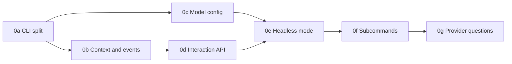

# Phase 0: Headless core

**Goal:** every operation can run without interactive prompts, with the model configured from flags or the environment, with machine-readable output, and the orchestration code is testable.
**Depends on:** nothing.
**Size:** L, split into seven parts.
**Ships as:** 0.5.0, released once every part has landed.

This phase is specified as seven part documents. Each part is a merge unit: it lands on `main` on its own, with green tests, and leaves the interactive `setup` and `deploy` flows behaving exactly as they did before. Parts are not releases — 0.5.0 ships when 0g lands.

| Part | Spec | Depends on | Size |
|------|------|------------|------|
| 0a | [Errors, exit codes and the CLI package split](0a-cli-split-and-errors.md) | – | M |
| 0b | [Context, events and provisioner injection](0b-context-and-events.md) | 0a | M |
| 0c | [Model configuration, tool checks, `config` commands and dependency hygiene](0c-model-config-and-tool-checks.md) | 0a | S |
| 0d | [Interaction API and the terminal implementation](0d-interaction-api.md) | 0b | M |
| 0e | [Headless mode — answer sources, the answer store and resume](0e-headless-mode.md) | 0c, 0d | L |
| 0f | [Headless subcommands and typed results](0f-headless-subcommands.md) | 0e | L |
| 0g | [Cloud provider questions and `env plan`](0g-provider-questions-and-plan.md) | 0f | M |

0c depends only on 0a and can be built in parallel with 0b and 0d.



## Scope

1. Separate UI from orchestration. Core code emits events and interacts with people through an `Interaction` API; only `opsmith/cli/` knows about terminals.
2. Model configuration from flags, environment variables or settings, validated once at startup.
3. The CLI contract from the [migration plan](../../notes/2026-09-04-migration-plan.md): `--output json`, `--non-interactive`, answers from flags, files and env, `--yes`, exit codes, error envelope.
4. Re-runnable commands: every answer is persisted the moment it is given, and a run that stops for an answer or an external action resumes on the next invocation.
5. Headless subcommands alongside the existing `setup` and `deploy` menus, including `env plan`.
6. Inject provisioners so strategies can be unit tested.
7. Dependency hygiene.

## Non-goals

- Changing the config schema (phase 1).
- Changing how compose is generated (phase 1).
- Removing the interactive `deploy` menu. It stays, implemented on top of the new core functions.

## Module layout

The layout every part builds towards. No part introduces a module outside it.

```
opsmith/
  core/
    __init__.py
    errors.py       OpsmithError(code, message, hint, details) and subclasses        0a
    events.py       Event, EventSink, NullSink                                       0b
    context.py      OpsmithContext(src_dir, deployments_path, interact, answers,
                    steps, events, agent, provisioner_factory)                       0b
    provisioners.py ProvisionerFactory                                               0b
    llm.py          model configuration resolution and agent construction            0c
    config.py       config parsing and validation                                    0c
    interaction.py  Interaction protocol, Choice, HeadlessInteraction,
                    MissingAnswerError, PendingActionError                        0d, 0e
    answers.py      persisted answers per environment, secrets to the secret store   0e
    steps.py        optional step ledger for non-idempotent steps                    0e
    results.py      SetupResult, EnvCreateResult, ReleaseResult, RunResult,
                    DestroyResult, ValidateResult                                    0f
    operations.py   the functions the menus and the subcommands both call            0f
    questions.py    question tree declarations and plan evaluation                   0g
  cli/
    __init__.py
    app.py          Typer app assembly, global options, output mode, exit codes      0a
    output.py       TextRenderer, JsonRenderer                                       0a
    interaction.py  TerminalInteraction                                              0d
    commands/
      setup.py      `setup`, `init`                                              0a, 0f
      deploy.py     interactive `deploy` menu (unchanged UX)                     0a, 0f
      analyze.py    `repomap` (until phase 5 replaces it)                            0a
      config.py     `config validate|schema|show`                                    0c
      env.py        `env list|plan|create|status`                                0f, 0g
      release.py    `release`, `update`, `run`, `destroy`                            0f
  main.py           re-exports `app` from cli.app so `opsmith.main:app` keeps working 0a
```

`deployment_strategies/`, `cloud_providers/`, `infra_provisioners/`, `service_detector.py`, `git_repo.py`, `repo_map.py` and `types.py` stay where they are. They lose every `inquirer` and `rich.print` call and take an `OpsmithContext` instead.

## Boundary rule

No module outside `opsmith/cli/` may import `inquirer`, `typer`, `click`, `rich.prompt`, `rich.print`, `rich.console` or `rich.status`. Logging-style output goes through `EventSink`. A test walks the package and fails on violations, so the rule cannot regress.

The test arrives in 0a with an allowlist of the modules that still import UI, and each part deletes its own entries: 0b removes the provisioners, the strategies, the detector, `repo_map.py` and `utils.py`; 0c removes what is left of the model options; 0d empties it. Shrinking the list is how the rule lands incrementally without an all-or-nothing gate at the end of the phase.

Three channels are easy to miss and are named explicitly because of it: `WaitingSpinner` (`utils.py:94`) wraps `rich.console` and `rich.status`; `repo_map.py` logs through `typer.echo`; and `GitRepo.__init__` raises `typer.Exit`.

## Where each acceptance criterion is proven

| # | Criterion | Part |
|--:|-----------|------|
| 1 | `OPSMITH_NON_INTERACTIVE=1 opsmith env create ... --output json` completes a deployment with no prompts, or exits 3 with a `MISSING_ANSWER` naming the key | 0f |
| 2 | `opsmith config validate --output json` works with the model supplied only through environment variables and with no docker or terraform on `PATH` | 0c |
| 3 | Running any command with stdin redirected from `/dev/null` never blocks on a prompt | 0e |
| 4 | The boundary test passes: no UI imports outside `opsmith/cli/` | 0d |
| 5 | The interactive `setup` and `deploy` flows behave as before for a user at a terminal | every part |
| 6 | Strategy tests run with fake provisioners and assert the terraform variables and ansible extra-vars for a deploy of one API service plus postgres | 0b |
| 7 | A run stopped by exit 3 resumes without re-asking, and a run stopped by exit 8 resumes at the wait once its check passes | 0e |
| 8 | A DNS wait whose records are never created exits 8 within the wait timeout with the records in `details` | 0e |
| 9 | `env plan --provider AWS --strategy Monolithic --accept-defaults` lists exactly the domains of routed services and the env vars without values, and a strategy declaring no questions still completes through the exit-3 loop | 0g |

## Risks and open questions

- The `deploy` menu and the headless commands must share code paths, or they will drift. Rule: the menu never calls a provisioner directly. Enforced from 0f.
- Third-party provider plugins break in 0g. There are none known; note it in the changelog.
- Editor prompts split into two kinds. Review editors in `setup` accept the proposal headless, since the written file is the review surface. Fix editors for a failing Dockerfile or compose file never accept anything; they exit 4 with the path and the validate command. They are classified in 0d and behave differently from 0e. The skill documents both.
- The secret store is not new. Env values already live in the `.env` on the VM and are fetched back on release; 0e adopts that as the secret store rather than adding a second one, and moves `build_env_vars` out of the plaintext `state.yml`.
- The split adds seven merge points where the tree must be coherent. The mitigation is the rule at the top: interactive UX unchanged after every part, tests green after every part.
