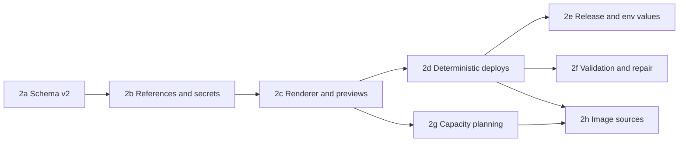

# Phase 2: Service model v2 and deterministic rendering

**Goal:** the config describes services in a strategy-neutral way, including prebuilt images, and the monolithic strategy renders docker-compose, env files and mounted files deterministically, with the model reserved for judgment: estimating what the expected workload needs, and judging whether a deployment came up, repairing the compose file when that is what failed.
**Depends on:** phase 0.
**Size:** XL, split into eight parts.
**Ships as:** 1.0.0 (schema version 2), released once every part has landed, in the same release as phase 3.

This phase is specified as eight part documents. Each part is a merge unit: it lands on `main` on its own, with green tests. After every part a v1 project still loads, validates and deploys (acceptance criterion 1), and no part can lose an existing environment's data or credentials. Parts are not releases: 1.0.0 ships once 2h has landed, together with phase 3.

| Part | Spec | Depends on | Size |
|------|------|------------|------|
| 2a | [Schema v2 and the v1 upgrade](2a-schema-v2-and-upgrade.md) | – | M |
| 2b | [References, secrets and provider specs](2b-references-secrets-and-providers.md) | 2a | M |
| 2c | [Compose renderer and preview commands](2c-compose-renderer-and-previews.md) | 2b | L |
| 2d | [Deterministic deploys](2d-deterministic-deploys.md) | 2c | L |
| 2e | [Release and env values](2e-release-and-env-values.md) | 2d | M |
| 2f | [Validation, repair and init jobs](2f-validation-repair-and-init-jobs.md) | 2d | M |
| 2g | [Capacity planning](2g-capacity-planning.md) | 2c | L |
| 2h | [Image sources and the deploy flow](2h-image-sources-and-deploy-flow.md) | 2d, 2g | S |

2e and 2f can be built in parallel once 2d has landed. 2g needs only 2c, so it can be built alongside 2d, 2e and 2f.

## Scope

1. Schema v2 for `deployments.yml`: image sources, routes, volumes, files, command, healthcheck, resources, init jobs, depends-on, infra instances with settings, env values with references. (2a, 2b)
2. The binding contract between config and strategies. (2b)
3. A deterministic compose renderer replacing `_generate_docker_compose`'s LLM loop. (2c, 2d)
4. Post-deploy validation by the model over facts gathered by code, repairing the deployed compose file when that is what failed. (2f)
5. Capacity planning as a strategy hook: the model estimates what the workload needs, the strategy decides the machines. (2g)
6. Deploy flow changes: registry and build only when something is buildable. (2h)
7. In-memory upgrade of v1 configs. (2a)
8. An `env vars` command that changes env values without a release, since `release` and `update` no longer ask for values that are already set. (2d, 2e)

## Non-goals

- Recipes themselves (phase 5). This phase makes them possible.
- Changing detection prompts beyond what the schema forces (phase 6 rewrites them).
- Kubernetes. The model is designed so a future strategy maps volumes to PVCs, routes to ingress, files to config maps, healthchecks to probes, resources to requests, and init jobs to jobs, and plans node pools through the capacity hook, without schema changes.

## Stopgaps between parts

Splitting the phase leaves a few stretches where one part has landed and the part that completes it has not. Each is deliberate, and each ends at a named part:

1. From 2a until 2d, the LLM compose path keeps working on renamed per-type snippets, `services/web_service.yml` and `services/worker.yml`. 2d deletes them along with the loop.
2. Nothing emits `value` templates or `secret()` before 2d, which is when detection starts writing them and deploys start honouring them. Between 2b and 2d, `config validate` accepts them, but only a hand-written config can hold them.
3. Between 2d and 2f, today's log-validation prompt decides whether a deploy succeeded, with no regeneration. A failed deploy is `DEPLOY_UNHEALTHY`, with the `compose.edit` fallback in a terminal.
4. Until 2e, `release` keeps redeploying the compose file it fetches from the machine. After 2d, that is the file `update` rendered.
5. Until 2g, the VM is still sized by the LLM machine-list step. Until 2h, a registry is created even when nothing is buildable.

## Where each acceptance criterion is proven

| # | Criterion | Part |
|--:|-----------|------|
| 1 | A v1 project loads, validates, and deploys without edits; the first save writes a v2 file and a backup | 2a, and every part after it |
| 2 | `env create` for a config with one `WEB_SERVICE` build service, one worker, postgres and redis makes exactly two model calls between detection and a healthy result, the capacity estimate and the post-deploy judgment, and renders a compose file identical to the golden file | 2g, once 2f has landed |
| 3 | A config with a single image source and no build sources runs `env create` without a registry or a build | 2h |
| 4 | A service with `healthcheck.http_path` that never becomes healthy fails with `DEPLOY_UNHEALTHY` and includes its logs in `details`, even when a scripted model calls the deploy successful | 2f |
| 5 | An `every_release` init job runs on `release` and its failure fails the release | 2f |
| 6 | `config validate` rejects a bad reference such as `{{ infra.nope.url }}` with the path to the offending env var, a `secret()` beside another reference, twice in one value or in a file, an unknown `format`, and one env var key declared by two services with different values | 2b |
| 7 | A fixture environment deployed from a v1 config with a captured LLM-style compose file, whose env file holds the legacy secret keys, renders a compose file with identical volume names, infra service keys and secret env keys, and `compose diff` shows only label and formatting changes | 2c |
| 8 | `compose diff --env dev` prints the difference between the rendered file and the file fetched from the VM without deploying | 2c |
| 9 | A service without `resources` gets its baseline from the capacity estimate, written to the config after confirmation and not requested again; the estimate runs once per `env create` and on `update` only when services, infra instances or the workload changed | 2g |
| 10 | A workload with `availability: high` produces a plan whose `unsupported` list names it, and `env create` proceeds only after the user confirms the plan; a plan that fits no machine type fails with `CAPACITY_UNSATISFIABLE` before any infrastructure is created | 2g |
| 11 | A stub strategy implementing `plan_capacity` with two node pools receives the same `CapacityEstimate` as the monolithic strategy for the same config and workload | 2g |
| 12 | When a scripted model finds the compose file at fault and returns a repaired one, that file is deployed and validated again, and the result carries a notice of the repair; the next `release` deploys the repaired file again, and the next `update` renders `docker-compose.yml` from the config | 2f |
| 13 | When the model finds the compose file not at fault, the command fails with `DEPLOY_UNHEALTHY` carrying its `reason` and `compose_at_fault: false`, without redeploying | 2f |
| 14 | Infra passwords and `secret()` values are generated once, recorded in `secrets.yml` before the stack is deployed, and reused on the next render; an `is_secret` env var with no `value` is prompted and never generated | 2d |
| 15 | Rendered files are written outside the repository, and `compose render` masks a `DATABASE_URL` whose value is `{{ infra.postgresql.url }}` although the config does not mark it secret | 2c (masking), 2d (files) |
| 16 | `release` renders nothing and deploys the working directory's `docker-compose.yml` byte for byte; with no local copy it fetches the machine's and writes it to the working directory first; it asks only for env values that are empty, while a value given with `--env-var` is still applied; and a config changed since the last `update` produces a notice pointing at `update` | 2e |
| 17 | `env vars --env dev --env-var KEY=VALUE` changes that key in the machine's `.env` without a build or a render, recreates only the services that read it, and validates the result; a key with a `value` in the config, or one the config does not declare, is refused with `INVALID_ARGUMENT` | 2e |
| 18 | `secret(32, format='urlsafe')` decodes as URL-safe base64 to 32 bytes, as a Fernet key must, and `"base64:{{ secret(32, format='base64') }}"` has the shape of a Laravel `APP_KEY`; each is generated once and read back unchanged on the next deploy | 2b (shapes), 2d (generated once) |
| 19 | `update` asks only for env values that are empty or not yet in the machine's `.env`; a value already set is kept, and one given with `--env-var` is applied | 2d |
| 20 | On an environment deployed before this phase, with the config unchanged, the first `update` reports the compose file as its only change and renders it, and a second `update` reports no changes | 2d |
| 21 | On an environment deployed before this phase whose compose file sets an env var the config does not declare, the first `update` lists it and asks `update.confirm_compose_upgrade` before deploying, and a headless run stops with exit 3 and the list in `details`. Once the key is declared in `deployments.yml`, the check passes and the value in the machine's `.env` is kept without a prompt | 2d |

## Compatibility with existing environments

An environment deployed before this phase has an LLM-generated compose file and an env file on the VM, data in Docker named volumes, and a v1 config. The first `update` after upgrading regenerates the compose file deterministically; until then `release` keeps deploying the LLM-generated file. The following invariants make that a no-op for data and credentials. Each has a test, in the part named:

1. **Volume names** (2c). Infra volumes are named `<instance>-data`, which for an upgraded v1 instance equals the legacy `<provider>-data` used by the current snippets. The compose project keeps living in `/home/<user>/app` on the VM, so Docker's derived volume names such as `app_postgresql-data` do not change and existing data is reattached.
2. **Secret keys** (2c, 2d). Infra credentials are read from the fetched env file under the legacy keys in `secret_env` before anything is generated, so the database keeps the password it was initialised with and connection strings stay valid.
3. **Start ordering** (2a, 2c). The v1 upgrade adds `depends_on` for every infra instance to every container service, matching the LLM-generated files.
4. **Application env values** (2d). Every key the fetched env file already holds a value for is kept without asking, since `update` asks only for empty or new keys, and the upgrade invents no `value` templates. No application variable changes unless the user edits the config or runs `env vars`.
5. **Traefik** (2c). Router names change to the per-route scheme, which Traefik reconfigures live; `acme.json` on the VM is untouched, so certificates are kept.
6. **Change detection** (2a, 2d). Deployed snapshots are upgraded the same way as the config, so the first `update` reports no spurious service or infra changes. The one change it does report is the compose file, because `state.yml` has no `compose_renderer_version` yet. That is what makes the first `update` render at all, since `update` does nothing when it finds no changes.
7. **Capacity** (2g). Existing environments have no stored plan and a default hobby workload. `update` neither re-plans nor resizes them unless the workload profile is edited, and `env resize` is always explicit.

The first render can still drop something the model added to the v1 file beyond what the config says, so 2d checks that render before deploying it: see [the first render of a v1 environment](2d-deterministic-deploys.md#the-first-render-of-a-v1-environment).

Hand edits to the compose file on the VM are overwritten by the next `release` or `update`. Phase 3 ships in the same release and provides `overrides/compose.override.yml` as the place to keep them; `compose diff` shows what an `update` would change. The changelog for this release states that the first `update` regenerates the compose file on the VM and points at `compose diff`.

## Harness surface

This phase invalidates more of the skill than any other, because it replaces the thing a harness writes. Per the [definition of done](../../notes/2026-09-04-migration-plan.md#definition-of-done-for-a-phase), each part updates the skill for what it makes usable, in its own harness-surface section, so the skill is complete for the phase when 2h lands.

## Risks and open questions

- **2c.** Traefik router priorities with overlapping prefixes rely on rule length; document that recipes should list the most specific route last for readability, ordering does not matter functionally.
- **2f.** The model judges success, so it can fail a deploy the facts call healthy (that is the point of catching a service that is up but broken), and the same deploy can be judged differently on two runs. The floor bounds this in one direction only: a failed container is never judged a success.
- **2f.** A repair lasts until the next `update`, which renders from the config again, and then the same failure is repaired again, at one more model call each time. Two things are left to phase 3: a mechanism for keeping a repair, and a way to apply a fix whose cause is in `deployments.yml` to that file, including how the fix is proposed and confirmed, since the config belongs to the person. The nearest precedent is the capacity estimate's baseline resources, which are written to the config after confirmation. Until then the notice names the field, and the fix is carried over by hand.
- **2e.** `release` trusts the working directory's copy. A checkout whose copy is older than the machine's, because another checkout or CI ran `update` since, deploys the older file and undoes that update. Keeping the file committed avoids this; whether it stays committed is phase 3's to decide.
- Users who hand-edited the LLM-generated compose file lose those edits on the first `release` or `update` after upgrading. The changelog must say so, `compose diff` shows the change, and the compose override file from phase 3, shipped in the same release, is where such edits go.
- The split adds eight merge points where the tree must be coherent. The mitigation is the rule at the top and the stopgaps above: tests are green, and a v1 project still deploys, after every part.
